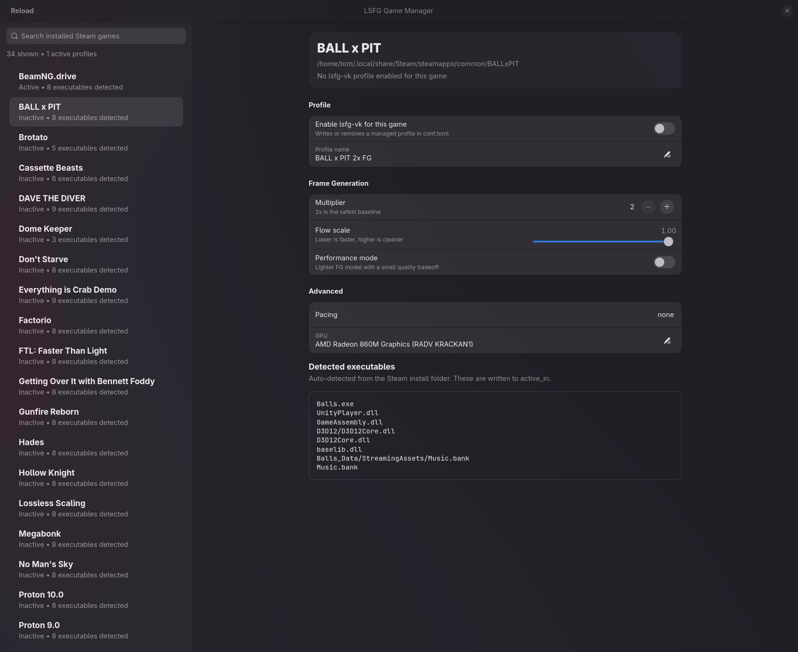

# LSFG Game Manager

Small native GTK/libadwaita desktop app for managing `lsfg-vk` profiles for Linux games.

## Screenshot



## What It Does

- Scans installed Steam games from `~/.local/share/Steam/steamapps`
- Detects the native Linux Hytale install from `~/.local/share/Hytale`
- Detects likely executables from each game install
- Lets you enable or disable `lsfg-vk` per game
- Edits `~/.config/lsfg-vk/conf.toml` directly
- Lets you override source paths from the app settings window
- Preserves unmanaged profiles and writes managed ones cleanly

## Run

```bash
./app.py
```

You can also run it with Python explicitly:

```bash
python app.py
```

With the project metadata in place, you can also run the package entry point directly:

```bash
python -m lsfg_vk_manager.main
```

## Smoke Test

```bash
python app.py --smoke-test
```

## Tests

```bash
python -m unittest discover -s tests
```

## Packaging

The project now includes a minimal `pyproject.toml` using `setuptools`.

Available entry points:

- `python -m lsfg_vk_manager.main`
- `lsfg-vk-manager` after installation

Note: GTK/libadwaita bindings (`PyGObject`) are expected to be provided by the system, not installed from PyPI by this project.

## Source Settings

Use the settings button in the header bar to override:

- Steam `steamapps`
- Steam `common`
- Hytale release path
- `lsfg-vk` `conf.toml`
- default GPU string

These values are stored in:

```bash
~/.config/lsfg-vk-manager/settings.toml
```

## Project Structure

The code is now split into a small package to keep responsibilities separate:

- `app.py`: thin launcher
- `lsfg_vk_manager/main.py`: CLI entry logic and smoke test
- `lsfg_vk_manager/ui.py`: GTK/libadwaita UI
- `lsfg_vk_manager/library.py`: game loading and profile matching
- `lsfg_vk_manager/config_store.py`: `conf.toml` persistence
- `lsfg_vk_manager/discovery.py`: executable discovery and scoring
- `lsfg_vk_manager/models.py`: shared dataclasses
- `lsfg_vk_manager/constants.py` and `lsfg_vk_manager/utils.py`: shared constants and helpers

## Notes

- Steam games are loaded from the local install under `~/.local/share/Steam`.
- Hytale is auto-detected from the native launcher install under `~/.local/share/Hytale`.
